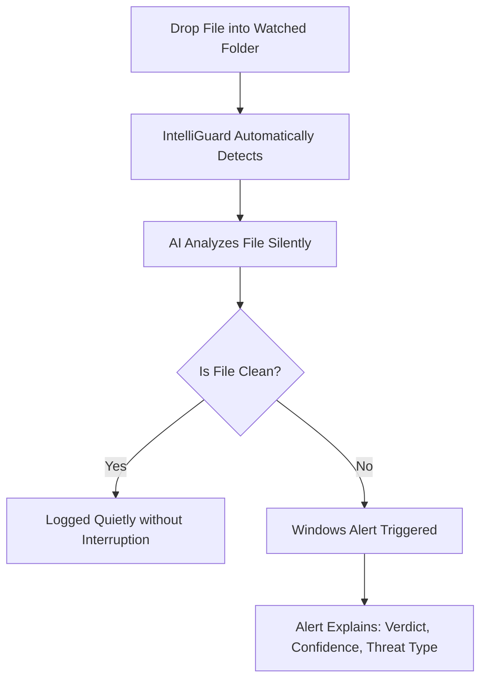

# 🛡️ IntelliGuard EDR — Intelligent Endpoint Detection & Response


**IntelliGuard** is a background-running Windows application that actively monitors your system, analyzes any new executable files using AI, and sends you a Windows notification if malware is detected. It tells you exactly *why* a file was flagged and what type of malware it likely is.

Unlike traditional antivirus solutions that rely on known signature databases, IntelliGuard uses machine learning on file structure (**Static Analysis**) and runtime behavior (**Dynamic Analysis**) to detect elusive, zero-day threats.

---

## 📂 Repository Structure

```text
IntelliGuard/
│
├── data/
│   ├── raw/               ← Kaggle, EMBER, BODMAS, CIC datasets
│   └── processed/         ← Cleaned features and train/val/test splits
│
├── src/
│   ├── utils/             ← Config, logger, memory management, metrics
│   ├── preprocessing/     ← Data ingestion and cleaning processors
│   ├── features/          ← Feature engineering and robust scaling
│   ├── models/            ← Random Forest, XGBoost, Fusion models & Training
│   ├── explainability/    ← SHAP engines and malware type hinting
│   └── detector/          ← File watcher, notifier, and analysis engine
│
├── models/                ← Trained Expert AI Models
├── outputs/
│   ├── scalers/           ← Fitted Scaler (.pkl)
│   ├── shap/              ← SHAP evaluation plots
│   └── metrics/           ← Evaluation results (JSON + PNG)
│
├── tests/                 ← Unit tests
├── .env                   ← Secrets (DO NOT COMMIT)
├── config.yaml            ← Central project configuration
├── requirements.txt       ← Python dependencies
└── main.py                ← Application Entry Point (GUI & Background Watcher)
```

---

## ⚙️ Prerequisites & Environment Setup

This project requires a Windows environment with an NVIDIA GPU for accelerated AI training.

### 1️⃣ System Dependencies
- Windows 10/11
- Python 3.10+
- NVIDIA GPU (Optional but highly recommended for fast XGBoost tree-building)

### 2️⃣ Install Python Dependencies
Open your terminal/command prompt:

```bash
# Clone the repository
git clone https://github.com/Jatin-source/IntelliGuard-EDR.git
cd IntelliGuard-EDR

# Create a virtual environment (Recommended)
python -m venv venv
venv\Scripts\activate

# Install dependencies
pip install -r requirements.txt
```

---

## 🚀 How to Run IntelliGuard

Once your dependencies are installed, you can launch the IntelliGuard system.

### Step 1 — Configure Environment
Ensure your `.env` contains your system-specific paths and configurations.

### Step 2 — Launch Application
Run the main entry file:

```bash
python main.py
```

### Step 3 — Usage Flow



---

## 🧠 AI Architecture & Machine Learning Approach

### 1. Static Analysis — Examining Without Running
IntelliGuard safely looks at the file's structure without executing it.
- **PE Header:** Execution flags, entry points.
- **Section Entropy:** Detection of encrypted or packed malware (High entropy = suspicious).
- **String Extraction:** Crypto wallet addresses, CMD strings, URL payloads.
- **Import Table:** Detects injection APIs (`WriteProcessMemory`), persistence techniques, etc.

### 2. Dynamic Analysis — Watching Behavior
Using our dynamic expert models (like Quo Vadis & CIC), IntelliGuard watches file execution inside monitored sandboxes.
- File creation & registry modifications.
- Network connections & process injections.
- Behavioral system-call sequences.

### 3. Late Fusion Engine


If both models agree strongly, a high-confidence alert is generated. If they diverge, it is flagged for manual review.

---

## 🔍 Explainability — SHAP AI Mapping

IntelliGuard doesn't just block a file; it tells you *why*. Using **SHAP (SHapley Additive exPlanations)**, it generates real reasons behind its decisions.

>**Alert Output Example:**
> "This file is 94% likely malware because **Bitcoin wallet strings** pushed the score up by 31%, **extremely high section entropy** by 28%, and **file deletion APIs** by 22%."

This data feeds directly into our **Malware Type Hint System** to classify threats into distinct families (Ransomware, Trojan, Spyware, Rootkit).

---

## 💾 Datasets

We built IntelliGuard on top of massive cybersecurity datasets to ensure robust detection limits:

- **EMBER 2024 (Win32 + Win64):** Comprehensive static PE header attributes, strings, and entropy values.
- **BODMAS:** 134,435 samples with 2,381 pre-extracted features + specific malware family labels.
- **Kaggle Malware Dataset:** Foundation dataset with base CSV structured header metadata.
- **Quo Vadis & CIC DIG 2025:** High-grade dynamic execution JSON sequences and behavior graphs.

---

## 📊 Key ML Rules We Follow

- **Train/Val/Test is sacred:** The test set is touched exactly once — at the very end.
- **False Negative Rate is Key:** Missing real malware is far worse than a false alarm. Target FNR is severely penalized.
- **RobustScaler Over StandardScaler:** Malware data has extreme outlier values. We scale against median IQR.

---

## 🛠 Technologies Used

- **Core Programming:** Python 3.10+
- **Machine Learning Models:** XGBoost (GPU Accelerated), Random Forest, Logistic Regression
- **Interpretability:** SHAP Data Explainers
- **Data Engineering:** Pandas, Numpy, Scipy, Imbalanced-Learn (SMOTE)
- **Malware Forensics:** `pefile`
- **Windows Integration:** `watchdog` (File monitoring), `win10toast` (Native notifications)
- **Visuals & Interfaces:** CustomTkinter, Matplotlib, Seaborn

---

## 🎯 Research Objective
To develop a high-performance endpoint detection agent capable of intercepting and neutralizing highly obfuscated zero-day threats using hybrid ML (Late Fusion) modeling, without causing high computational overhead during normal system usage.

---

## 👨‍💻 Author
**Jatin Hajare** — B.Tech CSE  
*Research Interests:* Network Security, Machine Learning in Cybersecurity, Endpoint Response systems, and Malware Analysis.

---

## ⭐ Project Status
✔ Base Watchdog & GUI Developed  
✔ Static Models Trained (BODMAS / EMBER)  
✔ SHAP Explainability Engine Developed  
⏳ Integrating Late Fusion w/ Quo Vadis Dynamic Analysis
